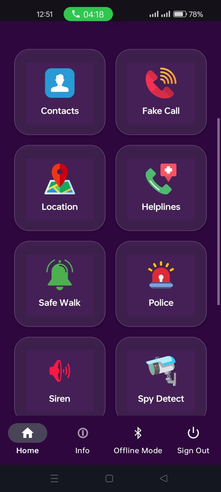
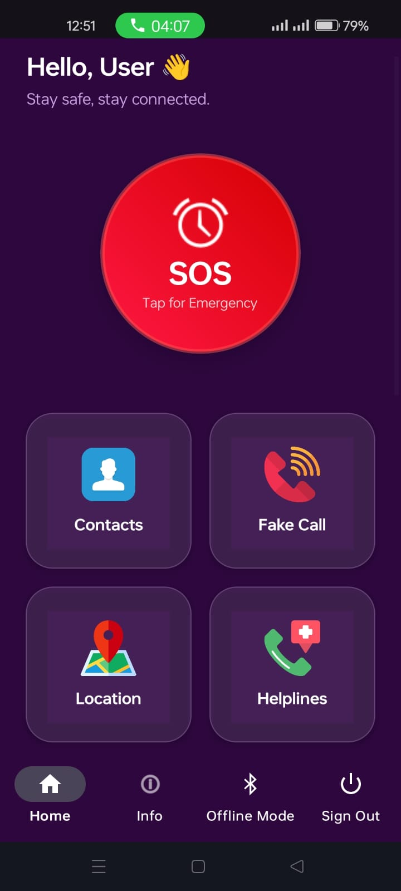
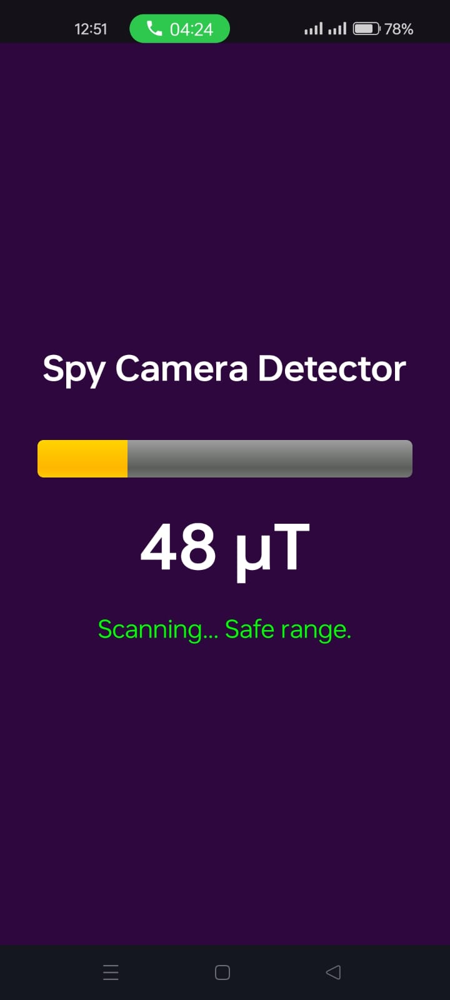
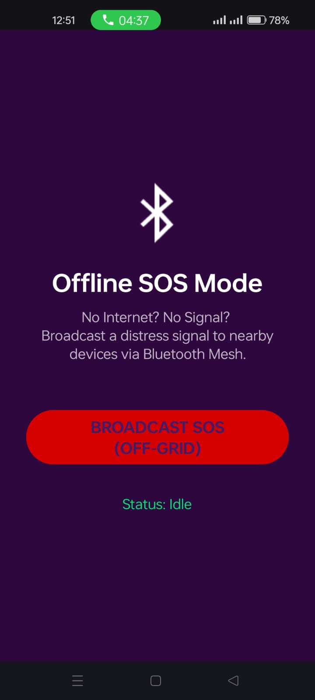
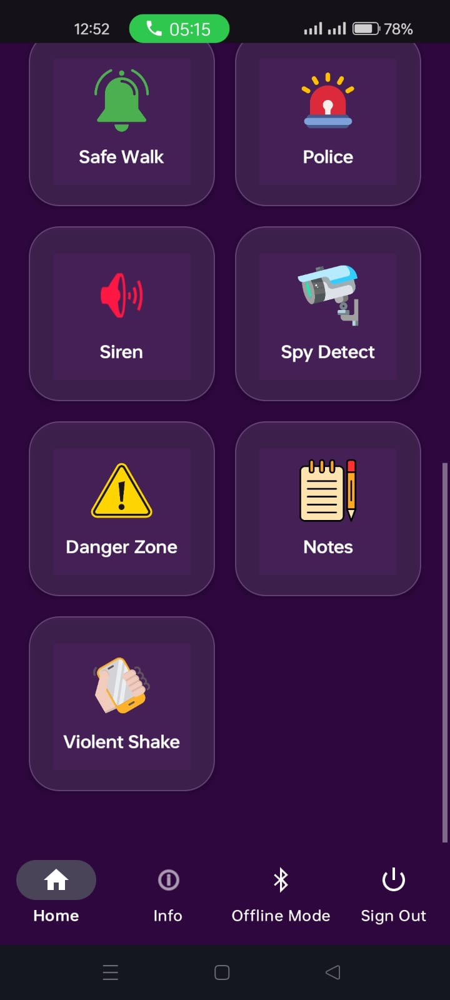

# 🛡️ Women Safety & Emergency Response System (Android)

> **“Technology shouldn’t just entertain — it should protect.”**

A robust, multi-functional **Android safety application** designed to provide **instant emergency assistance, preventive tools, offline connectivity, and secure evidence collection** for women in distress.
Built with a strong focus on **speed, stealth, reliability, and real-world usability**, this project bridges the gap between **reactive help** and **proactive personal safety**.

---

## 📖 Table of Contents

* [About the Project](#about-the-project)
* [Problem Statement](#problem-statement)
* [Solution Overview](#solution-overview)
* [Key Features](#key-features)

    * [Emergency Response](#emergency-response)
    * [Prevention & Utility](#prevention--utility)
    * [Advanced Connectivity](#advanced-connectivity)
    * [Reporting & Evidence](#reporting--evidence)
* [Tech Stack](#tech-stack)
* [Installation](#installation)
* [Usage Guide](#usage-guide)
* [Screenshots](#screenshots)
* [Future Scope](#future-scope)
* [Developers](#developers)
* [License](#license)

---

## 💡 About the Project

### 🔍 Problem Statement

Women often face unsafe situations where traditional safety solutions fail due to:

* **High response latency** — Unlocking a phone and dialing emergency numbers takes time.
* **No network availability** — Many apps fail in basements, rural areas, or during outages.
* **Lack of evidence** — Alerts are sent, but no data is preserved for legal or investigative use.

---

### ✅ Solution Overview

The **Women Safety & Emergency Response System** acts as a **comprehensive digital safety companion** by:

* Enabling **stealth emergency triggers** using hardware sensors.
* Providing **offline and peer-to-peer connectivity** when the internet is unavailable.
* Automatically collecting and storing **secure evidence** in the cloud.

---

## 🚀 Key Features

### 🚨 Emergency Response

* **One-Tap SOS**

    * Instantly sends emergency SMS messages with a **Google Maps location link** to trusted contacts.
    * Uses **high-accuracy GPS coordinates**.

* **Shake-to-Alert**

    * Background service monitors the accelerometer.
    * A vigorous shake (`g > 12`) triggers SOS **even when the phone is locked**.

* **Live Location Tracking**

    * Continuously shares real-time location updates with guardians.

---

### 🛡️ Prevention & Utility

* **Spy Camera Detector**

    * Uses the **Magnetometer** to detect abnormal electromagnetic fields.
    * Readings above **70 µT** alert users to potential hidden cameras or listening devices.

* **Insta-Siren**

    * Plays a **maximum-volume, high-frequency police siren** to deter attackers and attract attention.

* **Fake Call Mode**

    * Simulates a realistic incoming call screen to help users escape uncomfortable situations non-confrontationally.

---

### 📡 Advanced Connectivity

* **Offline Mesh Mode**

    * Broadcasts distress signals using **Bluetooth & Wi-Fi Direct**.
    * Nearby devices running the app receive alerts **without internet or GSM**.

* **Satellite Communication (Simulation)**

    * Demonstrates logic for routing emergency data to satellite modems on compatible hardware.

---

### 📝 Reporting & Evidence

* **Cloud Evidence Collection**

    * Automatically records **15 seconds of audio** silently during SOS.
    * Securely uploads recordings to **Firebase Storage**.

* **Secure Notes Vault**

    * Private cloud-synced space for logging incidents, harassment details, or observations.

* **Danger Zone Map**

    * Displays nearby **police stations** and reported unsafe locations on Google Maps.

---

## 🛠 Tech Stack

### 📱 Mobile Application

* **Language:** Java (Native Android SDK)
* **Architecture:** MVC (Model–View–Controller)
* **UI/UX:** XML Layouts, Custom Drawables, Glassmorphism Design

### ☁️ Backend (Firebase)

* Firebase Authentication
* Firebase Realtime Database
* Firebase Storage

### 🔌 APIs & Android Services

* Google Location Services (FusedLocationProvider)
* Google Maps SDK
* Android Sensor Framework (Accelerometer, Magnetometer)
* TelephonyManager & SMSManager
* MediaRecorder (Audio Evidence)

---

## 📥 Installation

### 1️⃣ Clone the Repository

```bash
git clone https://github.com/noormalik33/Women-Safety-App-Android.git
```

### 2️⃣ Open in Android Studio

* **File → Open**
* Select the cloned project folder

### 3️⃣ Firebase Setup

1. Create a project on **Firebase Console**
2. Enable:

    * Authentication (Email/Password)
    * Realtime Database
    * Storage
3. Download `google-services.json`
4. Place it inside the `app/` directory

### 4️⃣ Build & Run

* Sync Gradle files
* Run on a **physical Android device**

> ⚠️ Emulators do not fully support sensors and Bluetooth features.

---

## 📱 Usage Guide

* **Initial Setup**

    * Create an account
    * Add trusted contacts

* **Trigger SOS**

    * Tap the red **SOS button**
    * OR shake the phone **3 times vigorously**

* **Spy Camera Detection**

    * Open **Spy Detect**
    * Move phone near suspicious objects
    * Red indicator = high electronic activity

* **Offline Mode**

    * Navigate to **Info → Offline Mode**
    * Broadcasts local distress signals without internet

---

## 📸 Screenshots

### Dashboard | SOS Alert | Spy Detector

```html



```

### Offline Mode | Navigation | Notes

```html



```

---

## 🔮 Future Scope

* **Machine Learning Audio Detection**

    * TensorFlow Lite integration to detect screams or crash sounds.

* **Wearable Integration**

    * WearOS companion app for smartwatch-based SOS triggers.

* **Global Satellite Messaging**

    * Integration with Starlink / Iridium for true off-grid emergency communication.

## 📄 License

This project is licensed under the **MIT License**.
See the `LICENSE` file for more details.

---


## Contributing 🤝
Contributions are welcome! Please fork the repository, make changes, and submit a pull request. Report bugs or suggest features via GitHub Issues. 🌟
Contact 📬
For questions, feedback, or collaboration, reach out to:

---

## 👨‍💻 Developers

**Developed By**

* **Noor Malik**
* **Ghulam Qadir**

**Presented By:**
**CoreIT Tech**

**Noor Malik**  
IT Student  
📍 Islamabad, Pakistan  
📧 Email: noormalik56500@gmail.com  
🔗 [LinkedIn](https://www.linkedin.com/in/noormalik56500/)

**Ghulam Qadir**  
IT Student  
📍 Rawalpindi, Pakistan  
📧 Email: gqitspecialist@gmail.com 
🔗 [LinkedIn](https://www.linkedin.com/in/ghulam-qadir-07a982365)

Social 📱

📧 Email:coreittech1@gmail.com  
📹 YouTube1: https://www.youtube.com/@CoreITTech1  
📹 YouTube2: https://www.youtube.com/@CoreITTech
📸 Instagram: https://www.instagram.com/coreit.tech  
📘 Facebook: https://www.facebook.com/share/1AmgLDUnc9/

---

💡 If you like this project, don’t forget to star ⭐ it on GitHub!

    Happy coding! 🚀 Let’s build amazing UIs together! 💪
